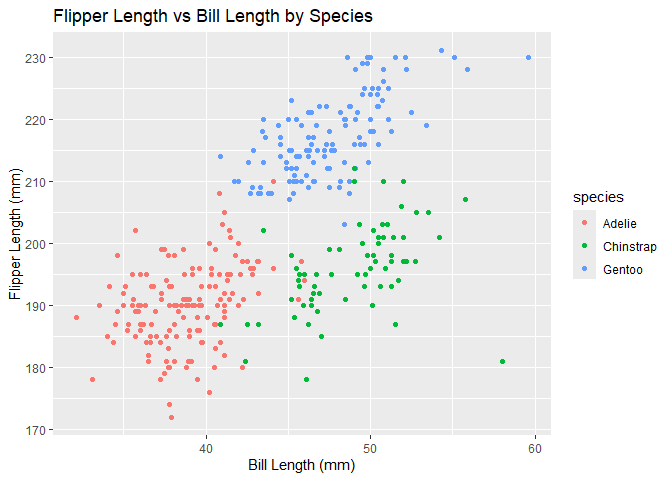

p8105_hw1
================
Senna
2024-09-21

Necessary packages and dataset are loaded.

``` r
library(ggplot2)
library(dplyr)
library(tidyverse)
data("penguins", package = "palmerpenguins")
```

## Problem 1

The Penguins dataset contains size measurements for 3 species of adult
foraging penguins observed near Palmer Station, Antarctica.

The size of the data set is 344 rows and 8 columns, in which the
variables are: species, island, bill_length_mm, bill_depth_mm,
flipper_length_mm, body_mass_g, sex, year.

Three different species, Adelie, Gentoo, Chinstrap were observed in 3
different islands. The sizes of the penguins were measured in terms of
bills, flippers, and weight. The mean flipper length is 200.915.

``` r
bill_flipper_plot <- ggplot(
  penguins, 
  aes(x = bill_length_mm, y = flipper_length_mm, color = species)) +
  geom_point() +
  labs(title = "Flipper Length vs Bill Length by Species",
       x = "Bill Length (mm)",
       y = "Flipper Length (mm)") 

print(bill_flipper_plot)
```

    ## Warning: Removed 2 rows containing missing values or values outside the scale range
    ## (`geom_point()`).

<!-- -->

``` r
ggsave("flipper_vs_bill_scatterplot.png", plot = bill_flipper_plot, width = 8, height = 6)
```

    ## Warning: Removed 2 rows containing missing values or values outside the scale range
    ## (`geom_point()`).

## Problem 2

Create a data frame as instructed.

``` r
set.seed(123)
sample = rnorm(10)
log_vec = sample > 0 
char_vec = letters[1:10]
fac_vec = factor(rep(c("A", "B", "C"), length.out = 10))

p2df = tibble(
  sample = sample,
  log_vec = log_vec,
  char_vec = char_vec,
  fac_vec = fac_vec
)
```

Try to take the mean of each variable.

``` r
mean_sample = mean(pull(p2df, sample))
mean_log_vec = mean(pull(p2df, log_vec))
mean_char_vec = mean(pull (p2df, char_vec))
```

    ## Warning in mean.default(pull(p2df, char_vec)): argument is not numeric or
    ## logical: returning NA

``` r
mean_fac_vec = mean(pull (p2df, fac_vec))
```

    ## Warning in mean.default(pull(p2df, fac_vec)): argument is not numeric or
    ## logical: returning NA

``` r
cat(
  "Mean of random_sample:", mean_sample, "\n",
  "Mean of logical_vector:", mean_log_vec, "\n",
  "Mean of character_vector:", mean_char_vec, "\n",
  "Mean of factor_vector:", mean_fac_vec, "\n")
```

    ## Mean of random_sample: 0.07462564 
    ##  Mean of logical_vector: 0.5 
    ##  Mean of character_vector: NA 
    ##  Mean of factor_vector: NA

Taking the mean of random sample works because it has dlb, or double, as
its data type. This is a type of numeric data, so the mean can be
computed.

Taking the mean of logic vector also works, since logical values can be
coerced to numeric values (TRUE = 1, FALSE = 0).

However, taking the mean of character vector or factor vector does not
work. Because they are not numeric data, and the mean() function cannot
operate on them.

``` r
num_log = as.numeric(pull(p2df, log_vec))
num_char = as.numeric(pull(p2df, char_vec))
```

    ## Warning: NAs introduced by coercion

``` r
num_fac = as.numeric(pull(p2df, fac_vec))
```

    ## Numeric logical vector: 0 0 1 1 1 1 1 0 0 0

    ## Numeric character vector: NA NA NA NA NA NA NA NA NA NA

    ## Numeric factor vector: 1 2 3 1 2 3 1 2 3 1
